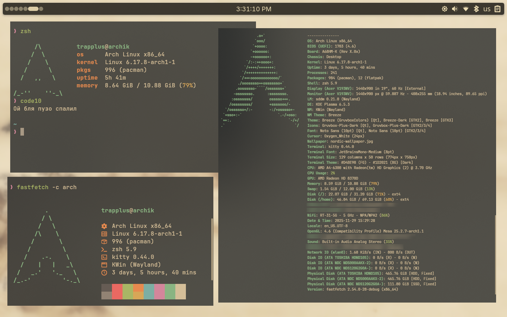
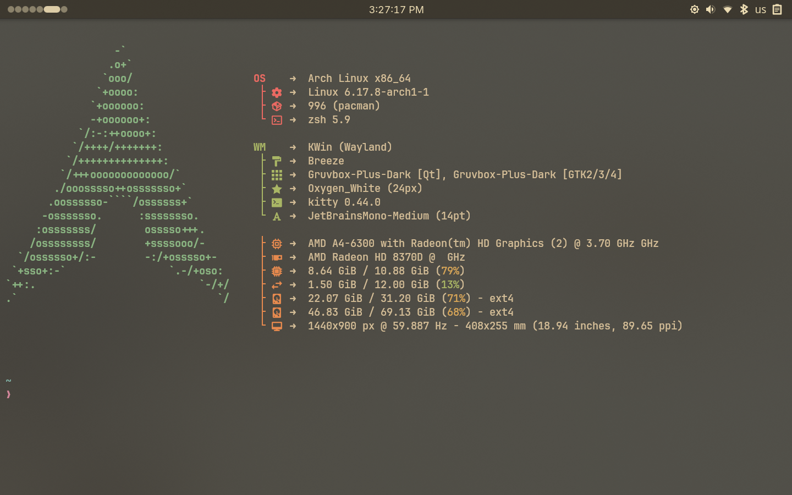

# Fastfetch Configs | Trapplus

### Custom Fastfetch configuration presets used in my personal shell dots.

[Fastfetch](https://github.com/fastfetch-cli/fastfetch) is a fast and highly customizable system information tool. This repository contains my configuration presets, originally created for an Arch Linux setup with Hyprland. You may freely clone, modify, or integrate them into your own environment.

<p align="center">
  
</p>
<p align="center">
  
</p>

## Overview

These configurations are part of my broader shell dotfiles collection and are designed to integrate cleanly with my environment. Presets include minimal, grouped, OS-focused, and full-info layouts.

## Installation

Clone the repository into:

```sh
cd ~/.local/share
git clone https://github.com/LierB/fastfetch
```

## Usage

Execute Fastfetch with any preset included in this repository:

```sh
fastfetch -c groups
fastfetch -c os
fastfetch -c arch
fastfetch -c full-info
```

Or run without specifying a preset:

```sh
fastfetch
```

Add optional parameters if needed:

```sh
fastfetch --colors-block-range-start 9 --colors-block-width 3
```

## Notes

* All configurations use JSONC format.
* Presets are easily customizable.
* These configs are included as part of my shell dots ecosystem.
